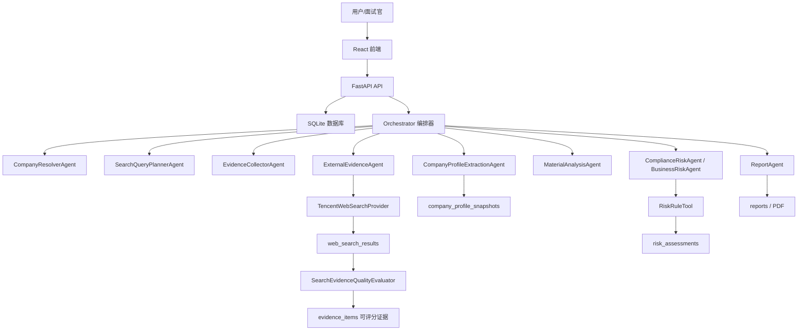

# SupplyGuard Agent 项目教程与简历说明

> 在线 Demo：<https://supplyguard-agent.onrender.com>  
> GitHub：<https://github.com/Lzy23331/supplyguard-agent>  
> 本文档用于帮助你从“项目拥有者/面试讲述者”的角度理解 SupplyGuard Agent：它有哪些文件、每个目录负责什么、Agent 工作流如何流转、评分参数代表什么，以及如何把项目写进简历。

## 1. 项目一句话说明

SupplyGuard Agent 是一个面向“供应商准入尽调”的 AI Agent 工作流 Demo。用户可以选择缓存演示案例，也可以输入真实企业名称和采购金额，系统会生成搜索计划、调用联网搜索 Provider、保存公开网页证据、进行主体匹配与证据可信度评估、抽取企业画像、按规则评分，并最终导出 Markdown/PDF 尽调报告。

这个项目并不是一个单纯的聊天机器人，而是一个“有流程、有状态、有证据链、有评分规则、有报告产物”的业务 Agent 系统。

## 2. 项目从 Hello Agent 到 SupplyGuard Agent 的变化

这个项目是在原先 hello-agent 类项目结构基础上改造出来的。hello-agent 更像一个通用 Agent 运行框架，而 SupplyGuard Agent 加入了具体业务场景：

- 业务对象：供应商、企业名称、采购金额、合作类型、补充材料。
- 业务流程：供应商准入尽调、联网搜索、证据评估、规则评分、人工复核建议。
- 虚拟业务文档：供应商准入政策、采购复核 SOP、合规检查清单、风险评级规则。
- Agent 链路：从任务创建到证据采集、材料分析、外部搜索、企业画像、评分、报告生成。
- 前端展示：公开演示首页、缓存 Demo、真实查询入口、任务列表、任务详情、证据链、时间线、报告和 PDF 下载。
- 部署闭环：Docker、Render Blueprint、免费实例部署、公开 URL。

你可以把它理解为：原来是一个“Agent 框架骨架”，现在被改造成了一个完整的“供应商风险准入业务系统”。

## 3. 项目总体架构



主线逻辑是：

1. 前端创建任务。
2. 后端写入 `diligence_tasks`。
3. Orchestrator 根据任务类型选择 Agent 链。
4. Agent 逐步收集证据、写事件、写数据库。
5. 规则引擎计算分数和风险等级。
6. 报告 Agent 生成 Markdown。
7. PDF 服务把 Markdown 转成中文 PDF。

## 4. 根目录文件说明

根目录是项目入口和部署配置层。

| 文件/目录 | 类型 | 作用 |
| --- | --- | --- |
| `README.md` | 文档 | 面向 GitHub/作品集的项目介绍，包含功能、技术栈、本地运行和部署说明。 |
| `PROJECT_TUTORIAL.md` | 文档 | 本文档，面向你自己理解项目和面试讲述。 |
| `DEMO_GUIDE.md` | 文档 | 线上演示时的推荐流程，告诉你先点哪里、展示什么。 |
| `DEPLOYMENT.md` | 文档 | Render/Docker 部署指南，说明环境变量和排错方式。 |
| `SECURITY.md` | 文档 | 密钥和公开站点安全边界说明。 |
| `.env.example` | 配置模板 | 只放变量名和占位符，不放真实密钥。 |
| `.env` | 本地密钥 | 本机真实环境变量文件，被 `.gitignore` 忽略，不能上传。 |
| `render.yaml` | Render Blueprint | Render 创建服务时读取的部署配置，当前使用 `plan: free`。 |
| `Dockerfile` | 部署构建 | 安装后端依赖、构建前端、安装中文字体、启动 FastAPI。 |
| `docker-compose.yml` | 本地容器 | 本地容器化运行用。 |
| `backend/` | 后端 | FastAPI、Agent、Provider、数据库、评分、报告。 |
| `frontend/` | 前端 | React + TypeScript 页面和组件。 |
| `data/` | 业务数据 | 虚拟供应商、缓存 Demo、政策知识库、mock 外部数据。 |
| `scripts/` | 脚本 | 本地启动、环境设置、Demo seed 脚本。 |

## 5. `data/`：虚拟业务文档、知识库和样例数据

`data/` 是这个项目的“业务世界”。它不属于代码逻辑本身，但 Agent 会读取它来模拟真实企业内部的制度、样例供应商和外部数据。

### 5.1 `data/policies/`

这是完整政策文档，更像企业内部制度原文：

- `supplier_onboarding_policy.md`：供应商准入政策，说明准入、补充材料、人工复核等规则。
- `procurement_review_sop.md`：采购复核 SOP，强调高额采购、紧急采购、负责人复核。
- `compliance_checklist.md`：合规检查清单，包括制裁、黑名单、出口管制、受益所有人透明度等。
- `risk_rating_rules.md`：风险评级规则，对低/中/高风险和评分逻辑做业务说明。

这些文档是“业务依据”，报告中的政策依据会优先引用它们。

### 5.2 `data/policy_knowledge_base/`

这是更短的知识库版本，供 `RAGPolicyTool` 检索使用。它相当于把长政策文档整理成更容易检索的片段。

对应代码：

- `backend/app/tools/rag_policy_tool.py`
- `backend/app/tools/rag_policy.py`

作用：

- 根据当前风险命中情况检索政策片段。
- 报告第 7 节“命中政策依据”会展示相关条款。
- 如果没有真实制裁/黑名单/行政处罚证据，就不会优先引用高风险政策，而是偏向资料完整性、高额采购、补充材料、人工复核。

### 5.3 `data/demo_cases/demo_cases.json`

缓存演示案例库，当前有 4 个案例：

- 比亚迪股份有限公司：低风险 Demo。
- 华为技术有限公司：中风险/人工复核 Demo。
- 小米通讯科技有限公司：标准准入/企业画像补全 Demo。
- 高风险供应商案例：高风险规则触发 Demo。

这个文件已经预置：

- 搜索 query。
- web search 结果。
- 企业画像字段。
- 维度分数。
- 命中规则。
- 推荐结论。

对应代码：

- `backend/app/services/demo_case_service.py`
- `scripts/seed_demo_cases.py`
- `frontend/src/pages/DemoGalleryPage.tsx`

面试时可以说：为了保证公开演示稳定，我设计了 Cached Demo Mode；它不消耗腾讯云/LLM API，但保留完整数据结构，能展示完整工作流。

### 5.4 `data/samples/` 和 `data/sample_suppliers/`

早期 MVP 样例供应商数据。主要用于“从样例供应商创建任务”的功能。

对应代码：

- `backend/app/services/seed_service.py`
- `backend/app/services/sample_service.py`
- `backend/app/tools/mock_search_tool.py`

### 5.5 `data/external_mock/`

模拟外部数据源：

- 企业画像 mock。
- 新闻 mock。
- 制裁 mock。

这部分主要用于 Provider fallback、单元测试和离线演示。

对应代码：

- `backend/app/evidence_providers/mock_company_info_provider.py`
- `backend/app/evidence_providers/mock_news_provider.py`
- `backend/app/evidence_providers/mock_sanctions_provider.py`

### 5.6 `data/internal/`

内部采购/供应商记录 CSV，用于模拟企业内部历史记录。

对应代码：

- `backend/app/evidence_providers/internal_record_csv_provider.py`

## 6. `backend/`：后端主体

后端是项目的核心，包括 FastAPI、数据库、Agent 编排、工具、真实 Provider、评分和报告。

### 6.1 `backend/app/main.py`：API 入口

这是 FastAPI 入口文件。主要职责：

- 初始化数据库。
- 暴露前端静态页面。
- 提供 REST API。
- 创建任务。
- 查询任务详情、事件、证据、报告。
- 导出 PDF。
- 返回 provider 状态。

重要路由：

| API | 作用 |
| --- | --- |
| `GET /` | 首页。 |
| `GET /app` | 创建任务页。 |
| `GET /demo` | 缓存演示案例页。 |
| `GET /tasks` | 任务列表页。 |
| `GET /tasks/{task_id}` | 任务详情页。 |
| `GET /api/health` | 健康检查。 |
| `GET /api/system/provider-status` | Provider 状态。 |
| `GET /api/demo-cases` | Demo 案例列表。 |
| `POST /api/demo-cases/{case_id}/run` | 创建缓存 Demo 任务。 |
| `POST /api/diligence/tasks` | 创建真实/自定义尽调任务。 |
| `GET /api/diligence/tasks` | 最近任务列表。 |
| `GET /api/diligence/tasks/{task_id}` | 任务详情。 |
| `GET /api/diligence/tasks/{task_id}/events` | Agent 时间线。 |
| `GET /api/diligence/tasks/{task_id}/evidence` | 证据链。 |
| `GET /api/diligence/tasks/{task_id}/report` | Markdown 报告。 |
| `GET /api/diligence/tasks/{task_id}/report.pdf` | PDF 报告。 |

真实查询的保护逻辑也在这里：

- `ENABLE_REAL_QUERY=true` 才允许真实查询。
- `REAL_QUERY_DAILY_LIMIT=20` 控制每日真实查询上限。
- `REAL_QUERY_CACHE_DAYS=7` 控制同名企业缓存复用。
- 同一企业 7 天内已有 completed 任务，会复用旧任务，避免重复消耗 API。

### 6.2 `backend/app/config.py`：配置中心

这个文件读取环境变量，比如：

- `MODEL_MODE`
- `OPENAI_BASE_URL`
- `OPENAI_MODEL`
- `DEEPSEEK_API_KEY`
- `WEB_SEARCH_PROVIDER`
- `WEB_SEARCH_API`
- `TENCENTCLOUD_SECRET_ID`
- `TENCENTCLOUD_SECRET_KEY`
- `ENABLE_REAL_QUERY`
- `REAL_QUERY_DAILY_LIMIT`
- `REAL_QUERY_CACHE_DAYS`

简历/面试里可以说：项目把 Provider 模式、LLM 模式和部署模式都配置化，避免把密钥或环境差异写死在代码里。

### 6.3 `backend/app/database.py`：数据库初始化

项目使用 SQLite 作为演示数据库。`database.py` 负责：

- 解析 `DATABASE_URL`。
- 创建数据库连接。
- 建表。
- 做兼容迁移。
- 创建真实查询用量表 `real_query_usage`。

核心表包括：

| 表名 | 作用 |
| --- | --- |
| `suppliers` | 供应商基础信息。 |
| `diligence_tasks` | 尽调任务主表。 |
| `agent_events` | Agent 时间线事件。 |
| `evidence_items` | 参与或展示的结构化证据。 |
| `web_search_results` | 全量联网搜索结果及质量评估。 |
| `company_profile_snapshots` | 企业画像抽取结果。 |
| `risk_assessments` | 风险评分结果。 |
| `reports` | Markdown 报告。 |
| `llm_call_logs` | LLM 调用/回退日志。 |
| `human_reviews` | 人工复核意见。 |
| `real_query_usage` | 真实查询每日限额统计。 |

### 6.4 `backend/app/repositories.py`：数据库读写层

这个文件封装数据库操作。上层 Agent/Service 不直接写 SQL，而是调用 repository 函数。

常见函数包括：

- 创建任务。
- 保存证据。
- 保存搜索结果。
- 保存报告。
- 保存风险评分。
- 保存 Agent event。
- 查询任务详情。
- 查询任务诊断数据。
- 查询真实查询用量。
- 查找 7 天内同名企业 completed 任务。

面试中如果被问“数据如何持久化”，可以说：核心状态均落到 SQLite，任务执行不是纯内存流；每一步 Agent 都会写 event，便于前端时间线和问题排查。

## 7. `backend/app/agents/`：Agent 工作流

Agent 是项目的业务流程层。`Orchestrator` 按顺序调用多个 Agent，每个 Agent 做一件明确的事。

### 7.1 `orchestrator.py`

编排器。它根据任务类型选择两套流程：

普通样例/自定义供应商：

1. `IntakeAgent`
2. `EvidenceCollectorAgent`
3. `MaterialAnalysisAgent`
4. `ComplianceRiskAgent`
5. `BusinessRiskAgent`
6. `ReportAgent`

真实企业名称查询：

1. `CompanyResolverAgent`
2. `SearchQueryPlannerAgent`
3. `IntakeAgent`
4. `EvidenceCollectorAgent`
5. `ExternalEvidenceAgent`
6. `CompanyProfileExtractionAgent`
7. `MaterialAnalysisAgent`
8. `ComplianceRiskAgent`
9. `BusinessRiskAgent`
10. `ReportAgent`

真实查询多了：

- 企业名称解析。
- 搜索 query 规划。
- 外部联网搜索。
- 企业画像抽取。

### 7.2 `base.py`

Agent 基类，统一提供：

- `started`
- `completed`
- `failed`
- `tool_called`
- `event`

这些方法会把过程写入 `agent_events`，前端 `AgentTimeline` 会展示。

### 7.3 `search_query_planner_agent.py`

生成搜索 query。底层调用：

- `backend/app/services/search_query_planner_service.py`

默认模板生成 5 条 query：

1. 行政处罚、失信、被执行人、经营异常。
2. 诉讼、合同纠纷、付款纠纷、质量问题。
3. 破产、出口管制、严重违法、欠税。
4. 官网、统一社会信用代码、注册资本、成立时间。
5. 企业信息、注册地址、经营范围、企业简介。

策略：

- 优先使用 LLM 规划 query。
- LLM 失败或未启用时 fallback 到模板 query。
- 每个任务最多保留 5 条 query，避免 API 消耗失控。

### 7.4 `external_evidence_agent.py`

外部证据入口。它调用 `EvidenceProviderManager`，再由 Provider Manager 调用真实或 mock Provider。

职责：

- 记录加载了哪些 Provider。
- 收集外部证据。
- 如果没有搜索结果，写入“不参与评分”的搜索覆盖说明。
- 把可评分证据保存到 `evidence_items`。

注意：第九批之后，普通搜索记录主要保存在 `web_search_results`，只有通过质量评估的 `score_evidence` 才同步写入 `evidence_items`。

### 7.5 `company_profile_extraction_agent.py`

企业画像抽取 Agent。它从 `web_search_results` 的 title、snippet、url、query 中抽取：

- 企业全称
- 官网
- 行业
- 地区
- 统一社会信用代码
- 注册资本
- 成立时间
- 法定代表人
- 注册地址
- 经营范围
- 经营状态

结果保存到 `company_profile_snapshots`。

底层规则在：

- `backend/app/services/company_profile_extractor.py`

重要原则：

- 画像是“搜索摘要推断”，不是官方工商核验。
- 每个字段有 `confidence`。
- 缺失字段会保留空值和缺失原因。
- `requires_manual_verification=true` 表示仍需人工复核。

### 7.6 `material_analysis_agent.py`

处理用户粘贴材料和上传文件材料。

它会从材料中抽取风险证据，并统一写入 `evidence_items`，字段包括：

- `source_type=user_input` 或 `uploaded_file`
- `title`
- `content`
- `raw_text`
- `risk_keywords`
- `confidence`
- `should_use_for_scoring`

### 7.7 `compliance_risk_agent.py` 和 `business_risk_agent.py`

分别负责：

- 合规风险分析。
- 经营与交付风险分析。

它们会调用工具和规则引擎，形成 `context["risk"]` 需要的信息。

### 7.8 `report.py`

报告 Agent。它汇总：

- 供应商基础信息。
- 风险评分。
- 证据链。
- 联网搜索结果。
- 企业画像。
- 政策依据。
- 人工复核建议。

然后调用：

- `ReportExportTool` 生成 Markdown。
- `LLMReportPolishService` 进行语言润色。

重要边界：

- LLM 只能润色语言。
- LLM 不能改变分数、风险等级、证据 URL、证据事实。

## 8. `backend/app/evidence_providers/`：外部证据源抽象层

Provider 层负责“去哪里找证据”。这样未来可以扩展天眼查、企查查、内部 ERP、黑名单 API 等，而不需要改 Agent 主流程。

### 8.1 `base.py`

定义统一证据结构 `EvidenceCandidate` 和 Provider 接口。

### 8.2 `provider_manager.py`

根据配置决定加载哪些 Provider：

- mock provider
- real provider
- Tencent web search provider

### 8.3 `tencent_web_search_provider.py`

真实腾讯云联网搜索 Provider。

流程：

1. 读取 SearchQueryPlannerAgent 生成的 query。
2. 每个任务最多 5 条 query。
3. 每条 query 最多保留 5 条结果。
4. 总结果最多 25 条。
5. 调用腾讯云 SearchPro API。
6. 标准化 title、url、snippet、rank、query。
7. 去重。
8. 质量评估。
9. 全量写入 `web_search_results`。
10. 只有 `decision=score_evidence` 的结果进入 `evidence_items`。

### 8.4 mock providers

用于本地测试和 fallback。主要文件：

- `mock_company_info_provider.py`
- `mock_news_provider.py`
- `mock_sanctions_provider.py`

## 9. `backend/app/services/`：业务服务层

Service 是项目的“策略层”，很多核心判断在这里。

### 9.1 `search_query_planner_service.py`

生成 5 条搜索 query。策略是 LLM 优先、模板兜底。

### 9.2 `search_result_deduplicator.py`

联网搜索结果去重。主要按：

- 完整 URL。
- 去参数 URL。
- 同域相似标题。
- 相似摘要。

### 9.3 `domain_trust_classifier.py`

域名可信度评分。比如：

- 官网、政府、法院、监管、权威数据库通常更可信。
- 普通采集站、低可信来源分数较低。

输出字段：

- `domain_trust_level`
- `domain_trust_score`
- `reason`

### 9.4 `search_evidence_quality_evaluator.py`

联网搜索证据质量评估核心文件。

它会计算：

- `entity_match_score`：主体匹配度。
- `risk_relevance_score`：风险相关性。
- `domain_trust_score`：来源可信度。
- `confidence`：综合置信度。
- `entity_relation_type`：主体关系类型。
- `decision`：最终处理决策。
- `decision_reason`：为什么这么处理。
- `matched_risk_keywords`：命中的规范风险标签。

规范风险标签包括：

- `administrative_penalty`：行政处罚
- `dishonesty_enforcement`：失信/被执行
- `business_abnormality`：经营异常
- `lawsuit_dispute`：诉讼/合同纠纷
- `quality_recall`：质量/召回
- `sanction_blacklist`：制裁/黑名单
- `negative_public_opinion`：负面舆情

最终决策：

| decision | 含义 |
| --- | --- |
| `score_evidence` | 可评分风险证据，会进入 `evidence_items` 并参与评分。 |
| `display_only` | 只展示，不参与评分。比如官网、普通新闻、关联主体、澄清新闻。 |
| `exclude` | 排除。比如重复、无 URL、主体无关、低可信来源。 |

进入评分必须同时满足：

- 有真实 URL。
- `entity_match_score >= 0.65`
- `risk_relevance_score >= 0.55`
- `domain_trust_score >= 0.35`
- 命中规范风险标签。
- `confidence >= 0.55`

这套设计可以防止“同名企业”“品牌新闻”“经销商新闻”“子公司事件”误伤目标供应商评分。

### 9.5 `evidence_scoring_service.py`

判断某条证据是否允许影响分数。

不会参与评分的典型情况：

- “未发现明显风险”。
- 普通搜索记录。
- 官网/百科/企业介绍。
- 缺少 URL。
- 主体匹配度低。
- 置信度低。
- `should_use_for_scoring=false`。

### 9.6 `company_profile_extractor.py`

从搜索结果抽取企业画像。它不爬正文，只基于 title、snippet、url、query 做规则抽取。

### 9.7 `llm_report_polish_service.py`

报告语言润色服务。

限制：

- 只能优化语言表达。
- 不能改风险分、等级、URL、证据事实。
- 失败时 fallback 原始报告。

### 9.8 `pdf_report_service.py`

把 Markdown 报告导出为 PDF。

它处理了中文字体问题：

- Windows 本地优先使用 Microsoft YaHei 等中文字体。
- Docker/Render 里安装 `fonts-noto-cjk`。

## 10. `backend/app/tools/`：工具层

Tools 是 Agent 可以调用的业务工具。

| 文件 | 作用 |
| --- | --- |
| `risk_rules.py` | 风险规则评分核心。 |
| `risk_rule_tool.py` | `RiskRuleTool` 导出包装。 |
| `rag_policy_tool.py` | 政策知识库检索。 |
| `mock_search_tool.py` | 样例供应商模拟搜索。 |
| `evidence_store.py` | 证据写入工具。 |
| `evidence_extraction_tool.py` | 从材料中抽取风险证据。 |
| `file_parser_tool.py` | 上传文件解析。 |
| `report_export.py` | Markdown 报告生成。 |
| `report_export_tool.py` | 报告工具包装。 |

## 11. 评分规则详解

核心文件：

- `backend/app/tools/risk_rules.py`
- `backend/app/services/evidence_scoring_service.py`

### 11.1 分数范围

最终分数是 0 到 100。

- `0-39`：低风险
- `40-69`：中风险
- `70-100`：高风险

但系统做了一个重要校准：

如果没有任何真实风险规则命中，只有资料完整性/采购暴露问题，总分最高限制为 45。这样可以避免“信息不全”把正常企业误判成高风险。

### 11.2 五个风险维度

| 维度 | 含义 | 典型来源 |
| --- | --- | --- |
| `compliance` 合规风险 | 制裁、黑名单、失信、行政处罚、贿赂欺诈 | web_search 可评分证据、用户材料、政策规则 |
| `business` 经营风险 | 经营异常、主体成熟度、采购金额暴露 | 企业画像、供应商资料、可评分证据 |
| `delivery` 交付风险 | 延期、合同纠纷、付款纠纷、紧急采购 | 用户材料、搜索证据 |
| `completeness` 资料完整性 | 官网、地区、行业、合作类型、受益所有人等缺失 | 供应商资料、企业画像 |
| `reputation` 声誉风险 | 负面舆情、投诉、媒体风险 | 搜索证据、材料证据 |

### 11.3 关键规则分值

高风险真实证据：

- 制裁/黑名单：40
- 重大失信/被执行：35
- 严重行政处罚：30
- 贿赂/欺诈：35

经营与交付：

- 经营异常：25
- 多次延期：20
- 多次付款纠纷：20
- 多次合同纠纷：10

资料和暴露：

- 高额采购：10
- 注册资料缺口：12
- 官网缺失：4
- 地区缺失：4
- 行业缺失：4
- 合作类型缺失：4
- 受益所有人缺失：8

这里的业务思路是：真实合规风险权重大；资料缺失会提高人工复核需求，但不应直接把企业打成高风险。

### 11.4 结果含义

| 风险等级 | 含义 | 建议 |
| --- | --- | --- |
| low | 未发现明确高风险，或只有轻微信息完整性问题 | 标准准入，纳入年度复查 |
| medium | 存在资料缺口、采购暴露或部分需复核信号 | 补充材料，采购/法务/合规人工复核 |
| high | 命中制裁、失信、严重行政处罚等明确风险 | 拒绝准入或升级审批 |

## 12. `frontend/`：前端结构

前端使用 React + TypeScript + Vite。

### 12.1 `frontend/src/App.tsx`

前端路由控制。它不是使用 React Router，而是自己解析 URL。

页面：

- `/`：首页。
- `/app`：创建新任务。
- `/demo`：缓存演示案例库。
- `/tasks`：历史任务。
- `/tasks/{task_id}`：任务详情。
- `/settings/status`：Provider 状态。

### 12.2 `frontend/src/api/client.ts`

前端 API 客户端。所有页面都通过这里访问后端。

主要方法：

- `getProviderStatus`
- `getDemoCases`
- `runDemoCase`
- `createDiligenceTask`
- `uploadMaterial`
- `getTasks`
- `getTask`
- `getTaskEvents`
- `getTaskEvidence`
- `getTaskReport`
- `getTaskReportPdf`
- `getTaskDiagnostics`
- `submitReview`

### 12.3 `frontend/src/pages/`

| 页面 | 文件 | 作用 |
| --- | --- | --- |
| 首页 | `LandingPage.tsx` | 作品展示入口，有创建任务、历史任务、缓存 Demo。 |
| Demo 案例库 | `DemoGalleryPage.tsx` | 展示 4 个缓存案例，可一键运行。 |
| 创建任务 | `TaskCreatePage.tsx` | 输入真实企业名称、金额、合作类型、材料、上传文件。 |
| 任务列表 | `TaskListPage.tsx` | 查看历史任务、打开详情、下载报告。 |
| 任务详情 | `TaskDetailPage.tsx` | 查看风险结果、证据链、时间线、报告、诊断数据。 |
| Provider 状态 | `ProviderStatusPage.tsx` | 展示 Demo/Real Query/腾讯云/LLM/PDF 是否可用，不展示密钥。 |

### 12.4 `frontend/src/components/`

| 组件 | 作用 |
| --- | --- |
| `CompanyNameSearchPanel.tsx` | 真实企业查询表单。 |
| `SupplierForm.tsx` | 自定义供应商表单。 |
| `MaterialInputBox.tsx` | 粘贴补充材料。 |
| `FileUploadPanel.tsx` | 上传材料文件。 |
| `AgentTimeline.tsx` | 展示 Agent events。 |
| `EvidenceList.tsx` | 展示 evidence_items。 |
| `RiskProfile.tsx` | 展示风险评分。 |
| `ReportViewer.tsx` | 展示 Markdown 报告和下载 PDF。 |
| `TaskProgressPanel.tsx` | 展示任务执行状态。 |
| `ReviewPanel.tsx` | 人工复核意见。 |

## 13. 一次完整真实查询任务的执行步骤

以输入“大疆创新科技有限公司，采购金额 500000，合作类型 常规采购”为例。

### 步骤 1：前端提交任务

文件：

- `frontend/src/pages/TaskCreatePage.tsx`
- `frontend/src/components/CompanyNameSearchPanel.tsx`
- `frontend/src/api/client.ts`

调用：

```text
POST /api/diligence/tasks
```

payload 包含：

- `company_name`
- `procurement_amount`
- `cooperation_type`
- `material_text`
- `upload_ids`
- `execution_mode`

### 步骤 2：后端检查真实查询权限

文件：

- `backend/app/main.py`

检查：

- 腾讯云 Secret 是否配置。
- Real Query 是否开启。
- 今日是否超过 `REAL_QUERY_DAILY_LIMIT`。
- 7 天内是否已有同名企业 completed 任务。

如果命中缓存，直接返回旧任务，避免重复消耗 API。

### 步骤 3：创建任务记录

文件：

- `backend/app/services/task_service.py`
- `backend/app/repositories.py`

写入：

- `suppliers`
- `diligence_tasks`

### 步骤 4：Orchestrator 启动 Agent 链

文件：

- `backend/app/agents/orchestrator.py`

如果是企业名称查询，走 `company_query_agents`。

### 步骤 5：生成搜索计划

文件：

- `backend/app/agents/search_query_planner_agent.py`
- `backend/app/services/search_query_planner_service.py`

生成 5 条 query，并写入 `agent_events`。

### 步骤 6：调用腾讯云联网搜索

文件：

- `backend/app/evidence_providers/tencent_web_search_provider.py`

每条 query 调用一次腾讯云 API，标准化返回结果。

写入：

- `web_search_results`
- `agent_events`

### 步骤 7：搜索结果去重与质量评估

文件：

- `search_result_deduplicator.py`
- `domain_trust_classifier.py`
- `search_evidence_quality_evaluator.py`

对每条结果判断：

- URL 是否真实。
- 是否重复。
- 域名可信度。
- 主体是否匹配目标企业。
- 是否是子公司/经销商/品牌新闻。
- 是否命中真实风险关键词。
- 是否形成可评分风险证据。

### 步骤 8：写入可评分证据

文件：

- `ExternalEvidenceAgent`
- `EvidenceStoreTool`

只有 `decision=score_evidence` 的搜索结果会进入 `evidence_items` 并参与评分。

普通搜索记录仍保存在 `web_search_results`，报告会展示。

### 步骤 9：抽取企业画像

文件：

- `CompanyProfileExtractionAgent`
- `CompanyProfileExtractor`

写入：

- `company_profile_snapshots`

### 步骤 10：分析用户材料/上传文件

文件：

- `MaterialAnalysisAgent`
- `EvidenceExtractionTool`
- `FileParserTool`

如果用户粘贴材料或上传文件，系统会抽取用户材料证据并写入 `evidence_items`。

### 步骤 11：规则评分

文件：

- `RiskRuleTool`
- `EvidenceScoringService`

输入：

- 可评分 evidence。
- 供应商资料。
- 企业画像字段。
- 采购金额。
- 合作类型。

输出：

- 总分。
- 风险等级。
- 维度分。
- 命中规则。
- 准入建议。

写入：

- `risk_assessments`

### 步骤 12：政策检索

文件：

- `RAGPolicyTool`
- `data/policy_knowledge_base/`

根据命中规则找相关政策依据。

### 步骤 13：生成报告

文件：

- `ReportAgent`
- `ReportExportTool`
- `LLMReportPolishService`

输出：

- Markdown 报告。
- 可下载 PDF。

写入：

- `reports`

### 步骤 14：前端展示

文件：

- `TaskDetailPage.tsx`
- `RiskProfile.tsx`
- `EvidenceList.tsx`
- `AgentTimeline.tsx`
- `ReportViewer.tsx`

展示：

- 风险评分。
- 证据链。
- Agent 时间线。
- 联网搜索记录。
- 企业画像。
- 报告。
- PDF 下载。

## 14. Agent Events 时间线怎么看

`agent_events` 是项目可解释性的关键。它记录：

- 哪个 Agent 开始。
- 调用了哪个工具。
- 生成了哪些 query。
- 每条 query 返回多少结果。
- 是否 fallback。
- 去重前后数量。
- 可评分/展示/排除数量。
- 报告展示了多少搜索记录。

前端组件：

- `frontend/src/components/AgentTimeline.tsx`

面试时可以说：这个项目不是黑盒模型输出，而是把每一步 Agent 行为持久化，方便审计和排错。

## 15. Demo Mode 和 Real Query Mode 的区别

| 模式 | 是否调用真实 API | 适合场景 | 数据来源 |
| --- | --- | --- | --- |
| Cached Demo Mode | 否 | 面试演示、稳定展示 | `data/demo_cases/demo_cases.json` |
| Real Query Mode | 是 | 展示真实链路 | 腾讯云联网搜索 + DeepSeek |

为什么要有 Demo Mode：

- 公开演示稳定。
- 不消耗 API。
- 不受腾讯云搜索结果波动影响。
- 保留完整任务结构和报告结构。

为什么要有 Real Query Mode：

- 证明系统不是静态页面。
- 可以输入新企业跑完整工作流。
- 展示真实 Provider、LLM、评分和报告闭环。

## 16. 线上部署

部署文件：

- `Dockerfile`
- `render.yaml`
- `DEPLOYMENT.md`

线上地址：

<https://supplyguard-agent.onrender.com>

Render 配置：

- `runtime: docker`
- `plan: free`
- `healthCheckPath: /api/health`
- `ENABLE_REAL_QUERY=true`
- `WEB_SEARCH_PROVIDER=real`
- `WEB_SEARCH_API=tencent`
- `OPENAI_BASE_URL=https://api.deepseek.com/v1`
- `OPENAI_MODEL=deepseek-chat`

Render Secret：

- `TENCENTCLOUD_SECRET_ID`
- `TENCENTCLOUD_SECRET_KEY`
- `DEEPSEEK_API_KEY`

公开站点安全边界：

- 前端不接触密钥。
- GitHub 不提交 `.env`。
- `/api/health` 只显示 configured，不显示 key 或 key 尾号。
- 报告和 PDF 不输出密钥。

## 17. 线上验收指标

最近一次线上验收：

- 首页 `/`：200
- Demo 页 `/demo`：200
- 历史任务 `/tasks`：200
- 创建页 `/app`：200
- Provider 状态页 `/settings/status`：200
- 任务详情页：200
- `/api/health`：正常
- Real Query：已启用
- 腾讯云 Provider：已配置
- DeepSeek LLM：已配置
- PDF 导出：可用
- 每日真实查询限制：20 次
- 缓存 Demo 任务可创建 completed 任务
- BYD Demo：query 5、搜索结果 8、真实 URL 8、企业画像字段 9、可评分风险证据 0
- PDF 下载：`application/pdf`

项目规模：

- 后端 Python 文件：约 133 个。
- 前端 TypeScript/TSX 文件：约 24 个。
- 后端测试文件：约 44 个。
- 政策文档：4 篇。
- 缓存演示案例：4 个。

## 18. 面试讲述建议

你可以按这个顺序讲：

1. 业务背景：供应商准入需要查公开信息、材料、政策，并形成可审计报告。
2. 痛点：人工搜索分散、同名主体容易误伤、证据难追溯、报告不统一。
3. 方案：构建多 Agent 工作流，每一步有明确职责。
4. 搜索质量：不是关键词扣分，而是主体匹配 + 风险相关 + 来源可信度 + 置信度。
5. 评分校准：真实高风险权重大；资料缺失只加人工复核风险；无风险不加分。
6. 可解释性：Agent events、web_search_results、evidence_items、risk_assessments、reports 全部持久化。
7. 演示闭环：缓存 Demo 稳定展示，Real Query 展示真实 API 能力。
8. 部署：Docker + Render，公开 URL 可访问。

## 19. 简历项目说明：SMART 版本

下面这段可以直接放进简历，风格参考你给的 SmartOfficeRAG 项目。

### SupplyGuard Agent：供应商准入尽调与风险研判 Agent 系统

**2026.06-2026.07**

- **背景介绍**：面向企业采购中的供应商准入与尽调场景，针对人工检索公开信息分散、同名企业/子公司/品牌新闻易误伤、风险证据难追溯、准入报告格式不统一等问题，构建可线上演示的供应商风险研判 Agent 系统，支持缓存案例演示与真实企业名称查询两种模式。
- **技术栈**：FastAPI、React、TypeScript、SQLite、Pydantic、ReportLab、Docker、Render、DeepSeek(OpenAI-compatible API)、Tencent Cloud Web Search API
- **项目实现**：
  1. **Agent 工作流构建**：设计 CompanyResolver、SearchQueryPlanner、EvidenceCollector、ExternalEvidence、CompanyProfileExtraction、MaterialAnalysis、RiskRule、ReportAgent 等多阶段流程，将任务创建、联网搜索、证据入库、画像抽取、规则评分和报告生成串成可审计闭环。
  2. **联网搜索证据评估**：接入腾讯云联网搜索 Provider，每任务默认生成 5 条风险/画像 query，保留最多 25 条搜索结果；构建去重、域名可信度、主体匹配、风险相关性和证据决策规则，区分 `score_evidence / display_only / exclude`，降低同名企业、经销商、子公司和品牌新闻误伤。
  3. **评分规则与报告体系**：构建 5 个风险维度和规则评分模型，覆盖合规、经营、交付、资料完整性、声誉风险；校准“资料缺失”和“真实高风险证据”的权重，确保无明确风险时不因普通搜索记录加分，并生成包含证据 URL、企业画像、政策依据、人工复核建议的 Markdown/PDF 报告。
  4. **演示与部署闭环**：实现 Cached Demo Mode 与 Real Query Mode 切换，内置 4 个稳定演示案例；支持真实企业名称、采购金额、合作类型和补充材料输入；通过 Docker + Render 部署为公开网站，并设置真实查询每日 20 次限额和 7 天同企业缓存复用。
- **项目成果**：系统已上线公开 Demo，支持首页展示、缓存案例运行、真实企业查询、Agent 时间线、证据链、数据对账、报告预览和 PDF 下载；线上验收中 BYD 缓存案例完成 5 条 query、8 条搜索记录、8 个真实 URL、9 个企业画像字段和完整报告导出。
- **上线展示**：<https://supplyguard-agent.onrender.com>

## 20. 简历更短版本

如果简历空间有限，可以用这个版本：

**SupplyGuard Agent：供应商准入尽调与风险研判 Agent 系统**  
面向企业采购供应商准入场景，构建 FastAPI + React 的多 Agent 风险研判系统，接入 DeepSeek 与腾讯云联网搜索，实现企业名称查询、搜索计划生成、公开网页证据入库、主体匹配/来源可信度/风险相关性评估、企业画像抽取、规则评分和 Markdown/PDF 报告导出。设计 Cached Demo 与 Real Query 双模式，内置 4 个稳定演示案例，并通过 Docker + Render 上线公开 Demo；系统支持每日真实查询限额、7 天同企业缓存复用、Agent 时间线、证据链和评分解释，线上案例可展示 5 条 query、8 条搜索记录、8 个真实 URL、9 个企业画像字段及完整报告。Demo：<https://supplyguard-agent.onrender.com>

