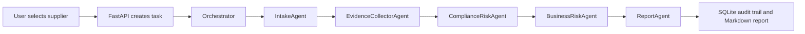

# SupplyGuard Agent

SupplyGuard Agent 是一个供应商准入尽调与风险研判系统，用于展示企业采购风控场景下的工程化 Agent 工作流。系统通过本地模拟数据、政策知识库、确定性规则引擎和可追溯 Agent 事件，完成供应商证据收集、风险评分和 Markdown 尽调报告生成。

> 本项目仅用于学习、演示和求职作品集展示。当前版本使用本地 mock 数据，不接入真实工商、司法、制裁、新闻或合规数据库，不构成真实法律、合规或商业决策建议。

## Project Path

推荐项目路径统一为：

```powershell
D:\projects\supplyguard-agent
```

Windows PowerShell 示例均按该路径编写，避免带空格路径造成脚本、Python、npm 或后续工具调用问题。

## Project Positioning

第一版优先保证稳定、可复现、可讲解：

- 不依赖真实 LLM API。
- 不依赖真实外部数据接口。
- 不使用复杂向量数据库，政策检索先采用本地 Markdown + 关键词检索。
- 风险分数和风险等级由规则引擎计算，不交给 LLM 随意判断。
- 所有关键过程写入 SQLite 和 agent events，方便前端展示与面试讲解。

## First-Batch Deliverables

- `data/samples/suppliers.json`：低、中、高风险三类供应商样例。
- `data/samples/mock_search_results.json`：可复现的模拟搜索证据链。
- `data/policies/risk_rating_rules.md`：0-100 分风险评分和准入建议规则。
- `data/policies/supplier_onboarding_policy.md`：供应商准入政策。
- `data/policies/compliance_checklist.md`：合规检查清单。
- `data/policies/procurement_review_sop.md`：采购复核 SOP。
- `docs/business-background.md`：业务背景和经济逻辑。
- `docs/architecture.md`：系统结构、流程图和时序图。

## Sample Suppliers

程序内部风险等级统一为 `low`、`medium`、`high`；前端和报告展示为低风险、中风险、高风险。

| 样例 | 供应商 | 关键特征 | 内部等级 | 展示标签 | 建议 |
| --- | --- | --- | --- | --- | --- |
| low | Aster Precision Components Co., Ltd. | 资料完整、经营稳定、无重大负面 | low | 低风险 | 建议准入 |
| medium | Nova Packaging Materials Ltd. | 交付延期、轻微合同争议、年度框架金额较高、需补充履约材料 | medium | 中风险 | 补充材料后准入或人工复核 |
| high | Northbridge Electronics Trading LLC | 境外信息不透明、紧急高额采购、疑似制裁/黑名单、多条纠纷 | high | 高风险 | 拒绝准入或升级审批 |

## Risk Model

规则引擎从 0 分开始，根据证据和供应商画像累加风险分：

- `raw_score`：所有命中规则累加后的原始分。
- `total_score`：对外展示和入库的分数，计算方式为 `min(raw_score, 100)`。
- `hit_rules`：每条命中规则、所属维度、分值和证据来源。

| 分数 | 内部等级 | 展示标签 | 处置 |
| --- | --- | --- | --- |
| 0-39 | low | 低风险 | 建议准入，按年度复查 |
| 40-69 | medium | 中风险 | 补充材料后准入，或进入人工复核 |
| 70-100 | high | 高风险 | 拒绝准入或升级审批 |

核心维度包括：

- compliance：制裁名单、黑名单、观察名单、出口管制、重大失信、行政处罚、商业贿赂、欺诈。
- business：经营状态、境外供应商、主体透明度、成立年限、高额采购。
- delivery：交付延期、付款纠纷、合同争议、紧急采购。
- completeness：官网、地区、行业、合作类型、受益所有人、资料缺失。
- reputation：负面舆情、客户投诉和公开纠纷。

## Agent Workflow



## Quick Start

Recommended on Windows PowerShell:

```powershell
cd "D:\projects\supplyguard-agent"
.\scripts\start-backend.ps1
```

Open a second PowerShell terminal:

```powershell
cd "D:\projects\supplyguard-agent"
.\scripts\start-frontend.ps1
```

Backend manually:

```powershell
cd "D:\projects\supplyguard-agent\backend"
python -m venv .venv
.\.venv\Scripts\Activate.ps1
pip install -r requirements.txt
python run.py
```

Frontend manually:

```powershell
cd "D:\projects\supplyguard-agent\frontend"
npm install
npm run dev
```

Open `http://127.0.0.1:5173` and choose a low、medium 或 high sample supplier.

## API Example

```powershell
Invoke-RestMethod -Method Post "http://127.0.0.1:8000/api/diligence/tasks" `
  -ContentType "application/json" `
  -Body '{"supplier":{"name":"Aster Precision Components Co., Ltd.","website":"https://example.com/aster","industry":"精密零部件","region":"江苏苏州","annual_spend":500000,"procurement_amount":500000,"cooperation_type":"标准采购","sample_key":"low","business_status":"正常","company_age_years":8,"profile_completeness":"高","ownership_transparency":"高","urgency":"常规"}}'
```

## Model Modes

Default mode is deterministic and requires no API key:

```powershell
$env:MODEL_MODE="mock"
```

LLM mode is an extension point only. In both modes, risk score and risk level remain rule-based.

## Roadmap

Next batches can proceed in this order:

1. 第二批：FastAPI 后端、SQLite、schema、seed data、MockSearchTool、RAGPolicyTool、RiskRuleTool 和最小测试。
2. 第三批：BaseAgent、agent_events、五个 Agent、Orchestrator 和报告生成。
3. 第四批：HTTP API、Swagger 验证和后端测试。
4. 第五批：React 前端任务创建、时间线、风险画像、证据链和报告查看。
5. 第六批：完善 README、架构文档、Agent 工程文档、面试讲解和最终测试。
