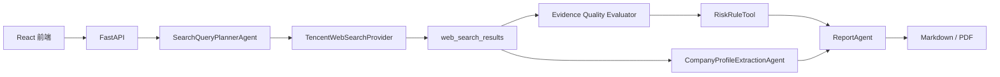

# SupplyGuard Agent

[](https://render.com/deploy?repo=https://github.com/Lzy23331/supplyguard-agent)

   

SupplyGuard Agent 是一个面向供应商准入场景的 AI 尽调与风险研判系统。项目将企业名称输入、LLM 搜索计划、腾讯云联网搜索、证据可信度评估、企业画像抽取、规则评分、Markdown/PDF 报告导出串成一个可部署的完整闭环。

## 核心功能

- Cached Demo Mode：内置比亚迪、华为、小米和高风险供应商案例，适合稳定演示。
- Real Query Mode：配置腾讯云与 DeepSeek 后，可对真实企业发起联网尽调。
- SearchQueryPlannerAgent：生成 5 条左右风险与画像查询语句。
- TencentWebSearchProvider：调用腾讯云联网搜索并保存真实 URL。
- SearchEvidenceQualityEvaluator：按主体匹配、来源可信度、风险相关性决定是否参与评分。
- CompanyProfileExtractionAgent：从标题、摘要、URL、query 中抽取企业基础信息。
- RiskRuleTool / EvidenceScoringService：规则引擎决定最终分数、风险等级和准入建议。
- ReportAgent：生成 Markdown 报告，并可调用 LLM 优化语言表达。
- PDF Export：中文 PDF 下载，文件名绑定当前 task_id。

## 技术栈

- Frontend：React、TypeScript、Vite、Lucide Icons
- Backend：FastAPI、SQLite、ReportLab、Pydantic
- LLM：DeepSeek / OpenAI-compatible API
- External Provider：Tencent Cloud Web Search API
- Deployment：Docker、Render Blueprint

## 系统架构



## 本地运行

```powershell
cd D:\projects\SupplyGuard-Agent
.\.venv\Scripts\python.exe scripts\seed_demo_cases.py
cd frontend
npm install
npm run build
cd ..
$env:PYTHONPATH='D:\projects\SupplyGuard-Agent\backend'
.\.venv\Scripts\python.exe -m uvicorn app.main:app --host 127.0.0.1 --port 8001
```

访问：`http://127.0.0.1:8001/`

## 环境变量

复制 `.env.example` 到 `.env`，只在后端或部署平台 Secret 中配置密钥。不要把任何真实 key 提交到 GitHub。

关键变量：

```env
MODEL_MODE=llm
OPENAI_BASE_URL=https://api.deepseek.com/v1
OPENAI_API_KEY=<DeepSeek 或 OpenAI-compatible Secret>
OPENAI_MODEL=deepseek-chat
WEB_SEARCH_PROVIDER=real
WEB_SEARCH_API=tencent
TENCENTCLOUD_SECRET_ID=<Render Secret>
TENCENTCLOUD_SECRET_KEY=<Render Secret>
ENABLE_REAL_QUERY=true
REAL_QUERY_DAILY_LIMIT=20
CACHE_DEMO_TASKS=true
```

## 部署

推荐 Render Web Service + Docker。仓库包含 `Dockerfile` 和 `render.yaml`，FastAPI 会同时托管 API 与前端静态文件。

1. 在 Render 选择 New Blueprint 或 New Web Service。
2. 连接 GitHub 仓库。
3. 使用 Docker 环境。
4. 在 Environment Variables 中填入腾讯云与 DeepSeek Secret。
5. 访问 `/api/health` 检查 masked 配置状态。

更多见 [DEPLOYMENT.md](./DEPLOYMENT.md)。

## 演示案例

- 比亚迪股份有限公司：低风险，展示普通搜索记录不参与评分。
- 华为技术有限公司：高关注主体，展示人工复核提示。
- 小米通讯技术有限公司：标准准入，展示企业画像补全。
- 高风险供应商案例：展示规则引擎如何触发高风险。

推荐演示流程见 [DEMO_GUIDE.md](./DEMO_GUIDE.md)。

## 安全声明

- 前端不接触腾讯云或 LLM API Key。
- `/api/health` 和 Provider 状态只返回 configured/masked 状态。
- 报告、PDF、Agent events 不输出 SecretId、SecretKey 或 API Key。
- 真实查询有全站每日调用限制，并优先复用 7 天内同名企业 completed 任务。

## 风险声明

本项目用于技术演示和作品展示，不构成投资、采购、法律或合规意见。正式供应商准入仍需人工复核，并以官方工商、司法、制裁和企业内部系统为准。

## 未来优化

- PostgreSQL 持久化替代 SQLite 演示库。
- 管理员鉴权与审计。
- 更细粒度 IP 限流和队列任务调度。
- 更多正式外部数据源接入。
