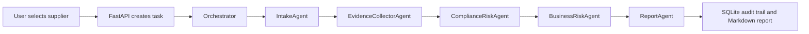

# SupplyGuard Agent

SupplyGuard Agent 是一个供应商准入尽调与风险研判系统，用于展示企业采购风控场景下的工程化 Agent 工作流。系统通过本地模拟数据、政策知识库、确定性规则引擎和可追溯 Agent 事件，完成供应商证据收集、风险评分和 Markdown 尽调报告生成。

> 本项目仅用于学习、演示和求职作品集展示。当前版本使用本地 mock 数据，不接入真实工商、司法、制裁、新闻或合规数据库，不构成真实法律、合规或商业决策建议。

## Project Positioning

项目参考多 Agent 工作流思想，但业务场景从通用助手迁移到企业采购和供应商准入风控。第一版优先保证稳定、可复现、可讲解：

- 不依赖真实 LLM API。
- 不依赖真实外部数据接口。
- 不引入复杂异步队列、WebSocket 或向量数据库。
- 风险分数和风险等级由规则引擎计算，不交给 LLM 随意判断。
- 所有关键过程写入 SQLite 和 agent events，方便前端展示与面试讲解。

## First-Batch Deliverables

第十三节第一批任务已落实为以下项目资产：

- `data/samples/suppliers.json`：低、中、高风险三类供应商样例。
- `data/samples/mock_search_results.json`：可复现的模拟搜索证据链。
- `data/policies/risk_rating_rules.md`：0-100 分风险评分和准入建议规则。
- `data/policies/supplier_onboarding_policy.md`：供应商准入政策。
- `data/policies/compliance_checklist.md`：合规检查清单。
- `data/policies/procurement_review_sop.md`：采购复核 SOP。
- `docs/business-background.md`：业务背景和经济逻辑。
- `docs/architecture.md`：系统结构、流程图和时序图。

## Sample Suppliers

| 样例 | 供应商 | 关键特征 | 预期等级 | 建议 |
| --- | --- | --- | --- | --- |
| Low | Aster Precision Components Co., Ltd. | 资料完整、经营稳定、无重大负面 | Low | 建议准入 |
| Medium | Nova Packaging Materials Ltd. | 交付延期、轻微合同争议、年度框架金额较高 | Medium | 补充材料后准入或人工复核 |
| High | Northbridge Electronics Trading LLC | 境外信息不透明、紧急高额采购、疑似制裁/黑名单、多条纠纷 | High | 拒绝准入或升级审批 |

## Risk Model

规则引擎从 0 分开始，根据证据和供应商画像累加风险分，最高截断为 100 分。

| 分数 | 等级 | 处置 |
| --- | --- | --- |
| 0-39 | Low | 建议准入，按年度复查 |
| 40-69 | Medium | 补充材料后准入，或进入人工复核 |
| 70-100 | High | 拒绝准入或升级审批 |

核心维度包括：

- compliance：制裁、黑名单、重大失信、行政处罚、贿赂、欺诈。
- business：经营状态、主体透明度、成立年限、采购金额。
- delivery：交付延期、付款纠纷、合同争议、紧急采购。
- completeness：官网、地区、行业、合作类型、受益所有人资料。
- reputation：负面舆情、客户投诉和公开纠纷。

## Agent Workflow



## Tech Stack

- Backend: Python, FastAPI, Pydantic, SQLite, pytest.
- Agent engineering: orchestrator, structured context, tool interfaces, policy retrieval, rules engine.
- Frontend: React, TypeScript, Vite, lucide-react, marked.
- Data: local JSON samples and Markdown policy knowledge base.

## Quick Start

Recommended on Windows PowerShell:

```powershell
cd "D:\projects\SupplyGuard Agent"
.\scripts\start-backend.ps1
```

Open a second PowerShell terminal:

```powershell
cd "D:\projects\SupplyGuard Agent"
.\scripts\start-frontend.ps1
```

Backend manually:

```powershell
cd "D:\projects\SupplyGuard Agent\backend"
python -m venv .venv
.\.venv\Scripts\Activate.ps1
pip install -r requirements.txt
python run.py
```

Frontend manually:

```powershell
cd "D:\projects\SupplyGuard Agent\frontend"
npm install
npm run dev
```

Open `http://127.0.0.1:5173` and choose a low, medium or high risk sample supplier.

## API Examples

Create a task:

```powershell
Invoke-RestMethod -Method Post "http://127.0.0.1:8000/api/diligence/tasks" `
  -ContentType "application/json" `
  -Body '{"supplier":{"name":"Aster Precision Components Co., Ltd.","website":"https://example.com/aster","industry":"精密零部件","region":"江苏苏州","annual_spend":500000,"procurement_amount":500000,"cooperation_type":"标准采购","sample_key":"low","business_status":"正常","company_age_years":8,"profile_completeness":"高","ownership_transparency":"高","urgency":"常规"}}'
```

Read events:

```powershell
Invoke-RestMethod "http://127.0.0.1:8000/api/diligence/tasks/{task_id}/events"
```

Read report:

```powershell
Invoke-RestMethod "http://127.0.0.1:8000/api/diligence/tasks/{task_id}/report"
```

## Model Modes

Default mode is deterministic and requires no API key:

```powershell
$env:MODEL_MODE="mock"
```

LLM mode is an extension point:

```powershell
$env:MODEL_MODE="llm"
$env:OPENAI_BASE_URL="https://api.openai.com/v1"
$env:OPENAI_API_KEY="..."
$env:OPENAI_MODEL="gpt-4o-mini"
```

In both modes, the risk score should remain rule-based.

## Roadmap

Next batches can proceed in this order:

1. Strengthen backend tests around risk rules and policy retrieval.
2. Expand Agent workflow and event observability.
3. Complete API endpoints and Swagger verification.
4. Polish frontend task creation, timeline, evidence chain and report viewer.
5. Add PDF export, async execution and richer evaluation after the MVP is stable.
