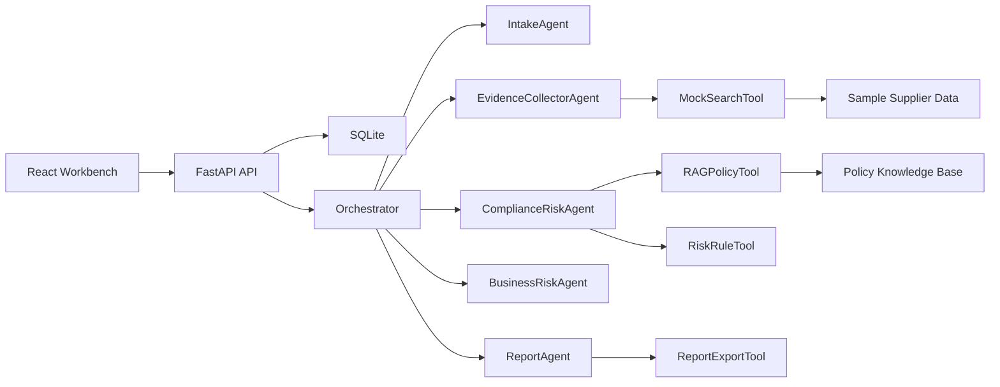

# Architecture

## System View

## Data Flow

1. The user creates a supplier diligence task.
2. FastAPI stores supplier and task rows in SQLite.
3. The orchestrator runs five agents synchronously for demo stability.
4. Each agent writes events to `agent_events`.
5. Tools collect evidence, retrieve policy and calculate risk scores.
6. The report agent writes a Markdown report.
7. The frontend reads task state, events, risk data and report content through HTTP.

## Persistence

SQLite tables cover the end-to-end audit trail:

- suppliers
- diligence_tasks
- evidence_items
- risk_assessments
- reports
- human_reviews
- agent_events

The synchronous v1 can later evolve to a queue-driven worker without changing the public API shape.

