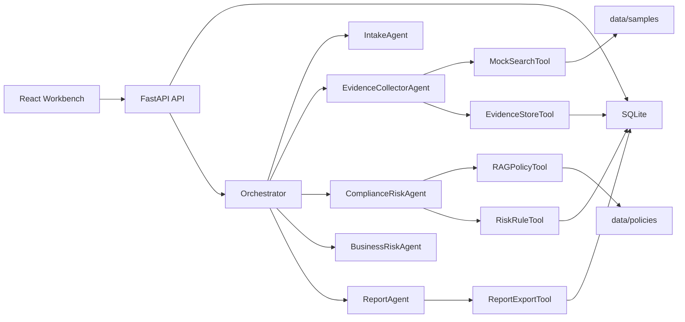
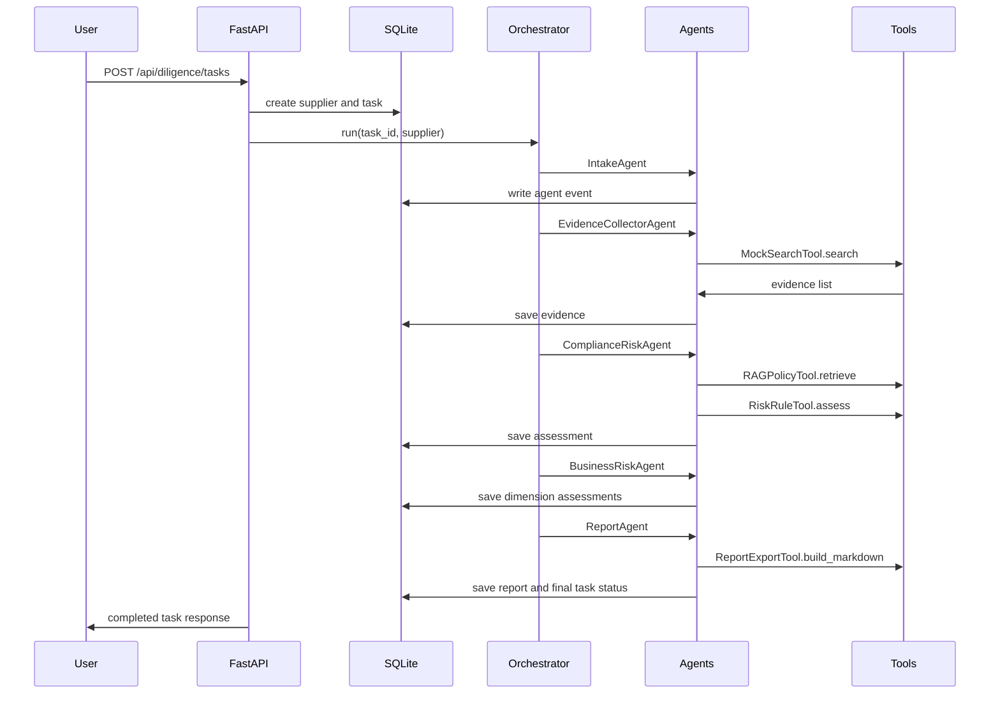

# Architecture

## 1. System View

## 2. First-Batch Scope

第一批任务负责把业务地基搭好：样例供应商、模拟搜索证据、政策知识库、风险评分规则、README 和架构说明。内部风险等级统一为 `low`、`medium`、`high`；展示层映射为低风险、中风险、高风险。

## 3. Runtime Flow

## 4. Data Flow

1. `MockSearchTool` reads deterministic evidence from `data/samples/mock_search_results.json`.
2. `RAGPolicyTool` reads local policy Markdown from `data/policies`.
3. `RiskRuleTool` calculates `raw_score`, `total_score`, `risk_level`, dimensions, `hit_rules` and recommendation.
4. `ReportExportTool` writes a stable Markdown report.
5. The frontend reads task state, evidence, events and report through HTTP APIs.

## 5. Persistence

SQLite tables cover the audit trail: suppliers, diligence_tasks, evidence_items, risk_assessments, reports, human_reviews and agent_events.

## 6. Extension Points And Batch Order

1. 第二批：backend data model, seed data, tools and tests.
2. 第三批：agent workflow and orchestrator.
3. 第四批：HTTP API and Swagger validation.
4. 第五批：React frontend workbench.
5. 第六批：documentation, demo script and final verification.

The synchronous v1 can later evolve to a queue-driven worker and SSE/WebSocket event stream without changing the core risk logic.
