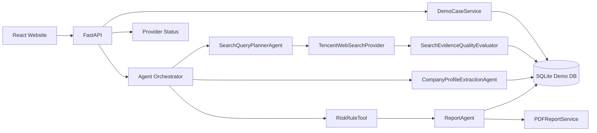

# SupplyGuard Agent Architecture

## Key Design

- Cached Demo Mode 默认启用，页面打开不会消耗腾讯云或 LLM API。
- Real Query Mode 由 `ENABLE_REAL_QUERY` 控制，只在后端密钥完整时开放。
- 搜索结果先入 `web_search_results`，只有 `decision=score_evidence` 的结果进入评分证据。
- 企业画像字段写入 `company_profile_snapshots`，字段级保存 `source_url`、`confidence` 和人工复核标记。
- 报告和 PDF 均绑定当前 `task_id`，避免历史任务导出混淆。
