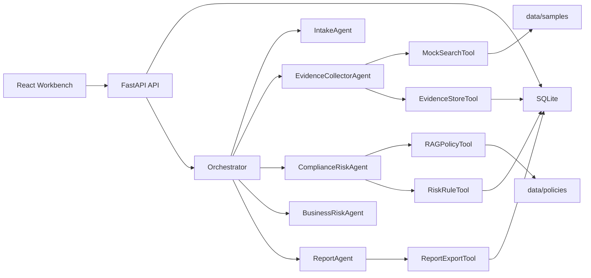
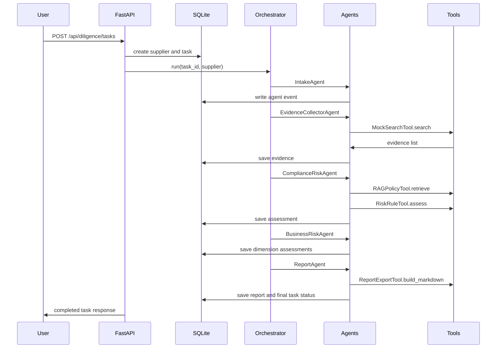

# Architecture

## 1. System View

## 2. First-Batch Scope

第十三节第一批任务的重点不是前端，也不是复杂后端，而是把项目的业务地基搭好：

1. 明确样例供应商：低、中、高风险各一个。
2. 明确模拟搜索证据：每条证据能解释为什么触发或不触发风险。
3. 明确政策知识库：准入政策、风险评分、合规清单和采购复核 SOP。
4. 明确规则引擎：分数、等级和准入建议都能追溯。
5. 明确项目讲解材料：README、业务背景和架构说明。

## 3. Runtime Flow

## 4. Data Flow

1. The user selects or submits a supplier.
2. FastAPI stores supplier and task records in SQLite.
3. The orchestrator runs five agents synchronously for demo stability.
4. `MockSearchTool` reads deterministic evidence from `data/samples/mock_search_results.json`.
5. `RAGPolicyTool` reads local policy Markdown from `data/policies`.
6. `RiskRuleTool` calculates total score, dimensions, hit rules and recommendation.
7. `ReportExportTool` writes a stable Markdown report.
8. The frontend reads task state, evidence, events and report through HTTP APIs.

## 5. Persistence

SQLite tables cover the audit trail:

- suppliers
- diligence_tasks
- evidence_items
- risk_assessments
- reports
- human_reviews
- agent_events

The synchronous v1 can later evolve to a queue-driven worker and SSE/WebSocket event stream without changing the core risk logic.

## 6. Extension Points

1. Replace `MockSearchTool` with real registry, sanctions and adverse media APIs.
2. Upgrade keyword policy retrieval to BM25 or vector retrieval after documents grow.
3. Add LLM mode for report phrasing while keeping rules deterministic.
4. Add PDF export, reviewer workflow and audit pack download.
